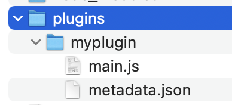

# How to load external plugins for development
🚧 The plugin system is changing rapidly, this page might not be up to date 🚧 

**Note:** Due to sandbox restrictions this will only work in Chrome

## Preparing Saifu
1. Download the latest chrome dev build (coming soon)
2. Navigate to your browsers extension settings and enable 'Developer mode' in the top right corner

3. Click 'Load unpacked' 
4. Navigate to the unpacked folder containing the Saifu dev version

If all worked fine, Saifu should load successfully


## Loading plugins for development

Inside the saifu folder, navigate to the folder `plugins`, or create it if it doesn't exist yet. 

Create a new sub-folder with your plugin name and copy the contents of your built plugin bundle (metadata.json + main.js)



On next open, Saifu will attempt to load your custom bundle. Navigate to the plugin settings and enable it


**Note:** Saifu will auto-reload plugins on change, no need to manually refresh the tab

### Hints:
- Inject sourcemaps into the bundle for easier development 
- Symlink or setup your plugin environment to automatically generate these files and put them into the right place

On mac, an easy way to do this is to use fswatch to copy files from the `dist/` folder into the correct location:
```
fswatch  . | xargs -n1 -I{} cp {} /path/to/saifu/plugins/myplugin/
```


